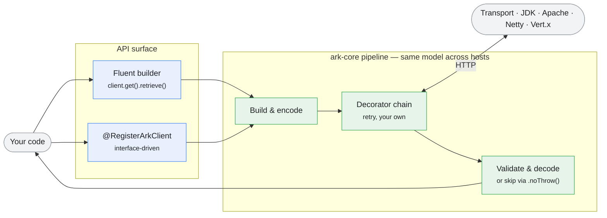

<div align="center">

<h1 align="center">
  <picture>
    <source media="(prefers-color-scheme: dark)" srcset="assets/logo/ark-logo-dark.svg">
    
  </picture>
</h1>

### Modular HTTP client toolkit for Java 17+

One client model that survives framework changes, transport changes, and execution-model changes.
Write **fluent** or **declarative** code; pick **JDK / Apache / Reactor Netty / Vert.x** under the
hood; run **sync / async / reactive**; host on **Spring Boot**, **Quarkus**, or a plain `main()`.
Compose **retry**, **metrics**, or your own behavior through `transport.with(...)` decorators.

[](https://central.sonatype.com/namespace/xyz.juandiii)
[](https://github.com/juandiii/ark/actions/workflows/ci.yml)
[](https://adoptium.net/)
[](LICENSE)

[**Quick Start**](#quick-start) • [**Frameworks**](#frameworks) • [**Execution Models**](#execution-models) • [**Architecture**](#architecture) • [**Documentation**](#documentation)

</div>

<div align="center" style="margin-top: 1em;">
<sub><i>Named after the</i> ark <i>- a vessel that carries safely across distance.</i></sub>
</div>

<br/>

## What is Ark?

Ark is an HTTP client toolkit for Java that separates the concerns other clients bundle: how you
**write** requests (fluent vs declarative), how they're **sent** (which transport), how they're
**serialized** (which JSON library), how they **execute** (sync / async / reactive), and where
they **run** (Spring / Quarkus / standalone). Each axis is pluggable - the rest stays the same.

**Core capabilities:**

- 🧩 **Fluent + declarative** - the `Ark` builder API _or_ `@RegisterArkClient` interfaces with `@HttpExchange` / JAX-RS annotations
- 🚢 **Pluggable transports** - JDK HttpClient, Apache HC5, Reactor Netty, Vert.x WebClient - swap without changing call sites
- 🔌 **Composable decorators** - `transport.with(Retry.of(...))` chains retry, your metrics, your tracing - same pattern everywhere
- ⚡ **Five execution models** - sync, async (`CompletableFuture`), Reactor (`Mono` / `Flux`), Mutiny (`Uni` / `Multi`), Vert.x (`Future`) - one API shape
- 🍃 **Any host** - Spring Boot MVC, Spring Boot WebFlux, Quarkus (JVM + native), or standalone - one client model
- 🛡️ **Permissive error handling** - `.noThrow()` per request _or_ `ark.client.<name>.throw-on-error=false` - inspect 4xx/5xx without exceptions
- 🔍 **Raw response access** - `.raw()` on every `*ClientResponse` _or_ declare `RawResponse` as a proxy return type - bypass deserialization when needed
- ⚙️ **GraalVM native** - reflection / proxy hints emitted automatically for both Spring Boot AOT and Quarkus build-time
- 📊 **Verified compat** - upstream Spring Boot / Quarkus patches tested weekly via CI matrix

---

## Quick Start

**1. Add Ark** - import the BOM and a host starter (Spring shown; [other frameworks](#frameworks) below):

```xml
<dependencyManagement>
  <dependencies>
    <dependency>
      <groupId>xyz.juandiii</groupId>
      <artifactId>ark-bom</artifactId>
      <version>${ark.version}</version> <!-- ark-bom -->
      <type>pom</type>
      <scope>import</scope>
    </dependency>
  </dependencies>
</dependencyManagement>

<dependency>
  <groupId>xyz.juandiii</groupId>
  <artifactId>ark-spring-boot-starter</artifactId>
</dependency>
```

**2. Write a declarative client:**

```java
@RegisterArkClient(configKey = "users-api")
@HttpExchange("/users")
public interface UserApi {

    @GetExchange("/{id}")
    User getUser(@PathVariable String id);

    @PostExchange
    User createUser(@RequestBody User user);
}
```

```properties
ark.client.users-api.base-url=https://api.example.com
ark.client.users-api.connect-timeout=5
```

**3. Inject and call it:**

```java
@Service
public class UserService {
    private final UserApi api;
    UserService(UserApi api) { this.api = api; }

    public User find(String id) { return api.getUser(id); }
}
```

Or use the **fluent** API directly — inject `ArkClient.Builder` (auto-configured by the starter):

```java
@Service
public class UserService {
    private final Ark client;

    UserService(ArkClient.Builder builder) {
        this.client = builder.baseUrl("https://api.example.com").build();
    }

    public User find(String id) {
        return client.get("/users/" + id)
                .accept(MediaType.APPLICATION_JSON)
                .retrieve()
                .body(User.class);
    }
}
```

The same model runs on every supported host - only the registration differs.

---

## Frameworks

All coordinates under `groupId` **`xyz.juandiii`**, versioned by the [BOM](#quick-start). Pick a host:

<details>
<summary><b>Spring Boot</b> (sync / MVC)</summary>

```xml
<dependency>
  <groupId>xyz.juandiii</groupId>
  <artifactId>ark-spring-boot-starter</artifactId>
</dependency>
```

Annotate interfaces with `@RegisterArkClient` + Spring's `@HttpExchange` family. The starter
auto-configures `Ark`, `AsyncArk`, and the proxy factory; AOT hints are emitted for native image.

</details>

<details>
<summary><b>Spring Boot</b> (reactive / WebFlux)</summary>

```xml
<dependency>
  <groupId>xyz.juandiii</groupId>
  <artifactId>ark-spring-boot-starter-webflux</artifactId>
</dependency>
```

Proxy methods return `Mono<T>` / `Flux<T>`; transport is Reactor Netty by default. Same
`@RegisterArkClient` interfaces work — just declare reactive return types.

</details>

<details>
<summary><b>Quarkus</b> (JVM + native)</summary>

```xml
<dependency>
  <groupId>xyz.juandiii</groupId>
  <artifactId>ark-quarkus-jackson</artifactId>
</dependency>
```

Annotate interfaces with `@RegisterArkClient` + JAX-RS (`@Path` / `@GET` / `@POST`) — or use
Spring's `@HttpExchange` if you prefer. Build-time reflection + proxy hints emitted for native.

</details>

<details>
<summary><b>Plain <code>main()</code></b></summary>

```java
Ark client = ArkClient.builder()
    .serializer(new JacksonSerializer(new ObjectMapper()))
    .transport(new ArkJdkSyncTransport(HttpClient.newHttpClient()))
    .baseUrl("https://api.example.com")
    .build();
```

`ark-core` has zero framework dependencies — assemble it yourself.

</details>

---

## Execution Models

The **same** `@RegisterArkClient` interface works across all five execution models. Pick by return type:

| Model | Module | Return type | Builder |
|---|---|---|---|
| **Sync** | `ark-core` | `T`, `ArkResponse<T>`, `RawResponse` | `ArkClient.builder()` |
| **Async** | `ark-async` | `CompletableFuture<T>` | `AsyncArkClient.builder()` |
| **Reactor** | `ark-reactor` | `Mono<T>` / `Flux<T>` | `ReactorArkClient.builder()` |
| **Mutiny** | `ark-mutiny` | `Uni<T>` / `Multi<T>` | `MutinyArkClient.builder()` |
| **Vert.x** | `ark-vertx` | `io.vertx.core.Future<T>` | `VertxArkClient.builder()` |

```java
@RegisterArkClient(configKey = "users-api")
public interface UserApi {
    @GetExchange("/{id}")  User                       getUserSync(String id);
    @GetExchange("/{id}")  CompletableFuture<User>    getUserAsync(String id);
    @GetExchange("/{id}")  Mono<User>                 getUserReactive(String id);
    @GetExchange("/{id}")  RawResponse                getUserRaw(String id);     // bypass deserialization
}
```

---

## How it compares

| | Ark | Apache HC5 | OkHttp | Spring RestClient | OpenFeign |
|---|:---:|:---:|:---:|:---:|:---:|
| Fluent API | ✅ | ⚠️ (Fluent ext) | ✅ | ✅ | ❌ |
| Declarative interfaces | ✅ | ❌ | ❌ | ✅ (via `@HttpExchange`) | ✅ |
| **Same interface across sync + async + reactive** | ✅ | ❌ | ❌ | ❌ <sub>(RestClient vs WebClient)</sub> | partial |
| Pluggable transports without code changes | ✅ | ❌ | ❌ | ⚠️ <sub>(`ClientHttpRequestFactory`)</sub> | ⚠️ |
| Decorator chain (`.with(...)`) | ✅ | ❌ | partial (interceptors) | ❌ | partial |
| Spring **+** Quarkus **+** standalone host | ✅ | standalone | standalone | Spring only | Spring only |
| Permissive error handling | ✅ | ✅ (manual) | ✅ (default) | partial (`onStatus`) | partial (`ErrorDecoder`) |
| GraalVM native | ✅ | ⚠️ | partial | ✅ | partial |

---

## Architecture

`ark-core` is plain Java with zero framework dependency. Hosts (Spring, Quarkus) plug in through
thin SPIs: `JsonSerializer`, `HttpTransport`, `RequestInterceptor`. Decorators stack via
`transport.with(...)` regardless of execution model.



The full nine-axis breakdown — 19 modules under `core/`, `execution-models/`, `transports/`,
`serializers/`, `proxies/`, `starters/`, `extensions/` — is in [`docs/design.md`](docs/design.md).

---

## Documentation

- [Getting Started](docs/getting-started.md) - fluent + declarative basics
- [Sync](docs/sync.md) / [Async](docs/async.md) / [Reactor](docs/reactor.md) / [Mutiny](docs/mutiny.md) - per-execution-model guides
- [Transport Model](docs/transports.md) - bridge pattern + decorator chain
- [Spring Boot Integration](docs/spring-boot.md) - starter + properties + AOT
- [Declarative Spring](docs/declarative-spring.md) - `@RegisterArkClient` + `@HttpExchange`
- [Quarkus](docs/quarkus-jackson.md) - extension + native image
- [Retry & Backoff](docs/retry.md) - decorator-based retry with per-model strategies
- [Logging](docs/logging.md) - `LoggingInterceptor` levels and redaction
- [Compatibility Matrix](docs/compatibility.md) - supported Spring Boot / Quarkus / Java versions
- [`docs/design.md`](docs/design.md) - architecture, SPIs, and the module layout

---

## Roadmap

- [x] Modular layout (19 modules grouped under semantic subdirectories)
- [x] Composable transport decorators (`transport.with(Retry.of(...))`) per execution model
- [x] Permissive error handling — per-request `.noThrow()` + client-level `throw-on-error` property
- [x] Raw response access — `.raw()` fluent + `RawResponse` as proxy return type
- [x] Weekly upstream compat sweep (Spring Boot / Quarkus latest patches via CI matrix)
- [ ] `RawResponse` return type for Vert.x proxies (handler stub pending)
- [ ] Observability decorators — OpenTelemetry tracing, Micrometer metrics
- [ ] Spring Cloud `@RefreshScope` support for hot-reload of `@RegisterArkClient` configs
- [ ] Tests for `ark-spring-boot-starter*` and `ark-quarkus-jackson` (plan 012)

---

## License

Apache 2.0. See [LICENSE](LICENSE).
